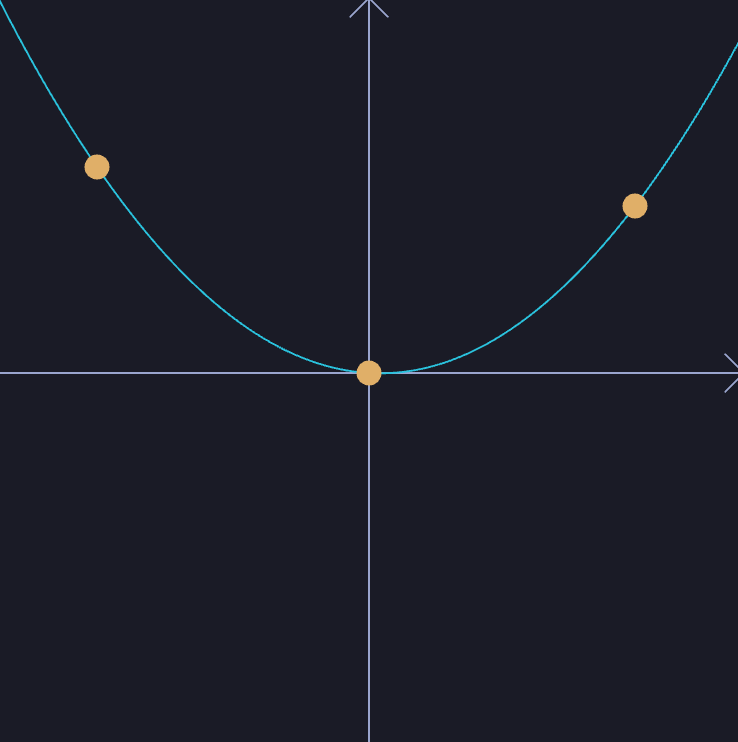

# Quadratic curve fitter

This is a simple interactive program that fits a quadratic to three movable control points.
The program has been written as an example / exercise of the GUI library [iced](https://iced.rs/) 

# Usage
```
cargo run --release
```

With the left mouse button, you can pick one of the control nodes and drag them. On mouse-over 
the cursor changes.

We show an example in the following image:

<figure>
    
    <figcaption>Screenshot of the quadratic shot program</figcaption>
</figure>

# Getting Started with Rust
If you are new to Rust, here is a quick start:

1. Install Rust
2. Build, run, and test the various components.

## Install Rust
For *Linux* and *MacOS* users, open a terminal and enter the following command:
```
curl --proto '=https' --tlsv1.3 https://sh.rustup.rs -sSf | sh
```
For *Windows* users, get to the website
[Windows Installer](https://www.rust-lang.org/tools/install).

In both cases, you will wind up with mainly three programs:
- **rustup**: This is the installer and updater.
- **rustc**: This is the core compiler of the Rust language. You will rarely interface with it directly.
- **cargo**: This program contains the package manager (something like PiPy in Python) and a complete build system.
  This program is the central entry to the Rust world.

## Build, Run, and Test the various components
Once you have installed Rust, clone the directory from the repository, open a terminal, and navigate to the base directory
where the file *Cargo.toml* is contained. From here, you may now run several commands:

- **cargo doc --open --no-deps**: Generates and opens the documentation in the browser.
- **cargo run --release** : Start the app. The ready compiled application is in target/release. 


# License
The program is published under the MIT license as explained in the [license file](LICENSE).